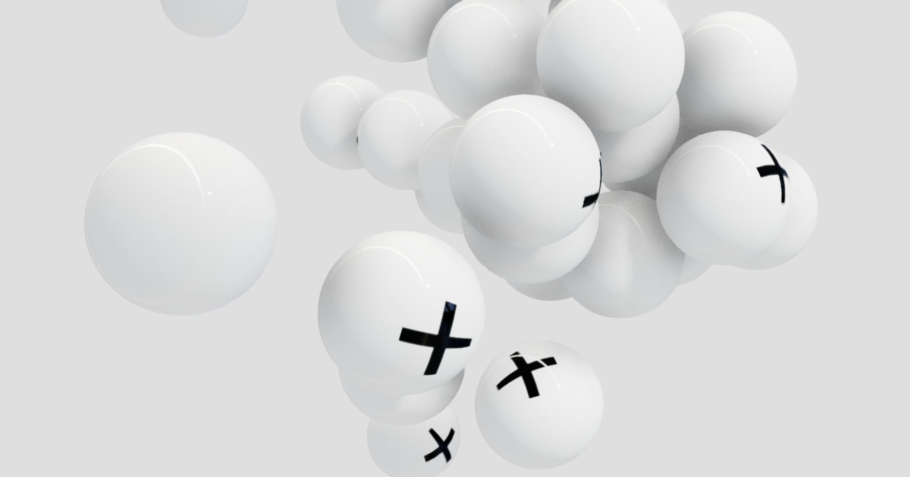

# 🎯 3D Physics Concept - Object Clump

[](https://nextjs.org/)
[](https://reactjs.org/)
[](https://threejs.org/)
[](https://opensource.org/licenses/MIT)

A mesmerizing 3D physics simulation built with React Three Fiber and Cannon.js, featuring objects that dynamically move towards a center point. This project is optimized for deployment on Webflow Cloud.



## ✨ Features

- 🎮 **Interactive 3D Physics**: 40 spheres with realistic physics simulation
- 🎯 **Center Attraction**: Objects automatically move towards the center point
- 🖱️ **Mouse Interaction**: Interactive pointer that affects the simulation
- 🌟 **Real-time Physics**: Gravity, damping, and collision detection
- 💡 **Beautiful Lighting**: Dynamic lighting with post-processing effects
- 📱 **Responsive Design**: Works on desktop and mobile devices
- ⚡ **Optimized Performance**: 60fps physics simulation

## 🛠️ Tech Stack

- **[Next.js 15](https://nextjs.org/)** - React framework with SSR support
- **[React Three Fiber](https://github.com/pmndrs/react-three-fiber)** - 3D rendering for React
- **[Cannon.js](https://github.com/pmndrs/cannon-es)** - Physics engine
- **[Three.js](https://threejs.org/)** - 3D graphics library
- **[Leva](https://github.com/pmndrs/leva)** - Debug controls and UI
- **[Webflow Cloud](https://webflow.com/cloud)** - Deployment platform

## 🚀 Quick Start

### Prerequisites

- Node.js 20.0.0 or higher
- npm or yarn package manager

### Installation

1. **Clone the repository**:
   ```bash
   git clone https://github.com/tgc-in-the-sky/3d-physics-concept.git
   cd 3d-physics-concept
   ```

2. **Install dependencies**:
   ```bash
   npm install
   ```

3. **Start development server**:
   ```bash
   npm run dev
   ```

4. **Open your browser**:
   Navigate to [http://localhost:3000](http://localhost:3000)

## 🎮 How to Use

- **Mouse Movement**: Move your mouse to control the pointer light
- **Debug Controls**: Use the Leva panel to adjust outline thickness
- **Physics**: Watch as 40 spheres are attracted to the center point
- **Performance**: The simulation runs at 60fps with optimized rendering

## 🌐 Deployment to Webflow Cloud

### Prerequisites

- A [Webflow account](https://webflow.com/)
- A [GitHub account](https://github.com/)
- Node.js 20.0.0 or higher

### Step-by-Step Deployment

1. **Install Webflow CLI**:
   ```bash
   npm install -g @webflow/webflow-cli
   ```

2. **Create a Webflow site**:
   - Clone the [Astral Fund template](https://webflow.com/templates/html/astral-fund-website-template) from Webflow
   - Give your site a name and configure access

3. **Initialize with Webflow Cloud**:
   ```bash
   webflow cloud init
   ```
   - Choose **Next.js** as your framework
   - Set your mount path (e.g., `/app`)
   - Authenticate with Webflow
   - Select your Webflow site

4. **Push to GitHub**:
   ```bash
   git add .
   git commit -m "Initial commit: 3D physics simulation"
   git branch -M main
   git remote add origin https://github.com/tgc-in-the-sky/3d-physics-concept.git
   git push -u origin main
   ```

5. **Create Webflow Cloud Project**:
   - In Webflow, go to your site settings
   - Select "Webflow Cloud" from the sidebar
   - Authenticate with GitHub
   - Create a new project with your GitHub repository URL
   - Create an environment with your mount path

6. **Deploy**:
   ```bash
   webflow cloud deploy
   ```

7. **Publish your Webflow site** to make the environment live

## 📁 Project Structure

```
3d-physics-concept/
├── pages/                 # Next.js pages
│   ├── _app.js           # App wrapper with global styles
│   └── index.js          # Main page with 3D scene
├── src/
│   ├── App.js            # 3D physics component
│   └── styles.css        # Global styles
├── public/               # Static assets
│   ├── adamsbridge.hdr   # Environment map
│   ├── cross.jpg         # Texture
│   └── favicon.ico       # Site icon
├── next.config.js        # Next.js configuration
├── webflow.json          # Webflow Cloud configuration
├── package.json          # Dependencies and scripts
└── README.md             # Project documentation
```

## 📜 Available Scripts

- `npm run dev` - Start development server
- `npm run build` - Build for production
- `npm run start` - Start production server
- `npm run lint` - Run linting

## 🔧 Configuration

### Next.js Config
The `next.config.js` file is configured for:
- 3D asset handling (HDR, GLB, GLTF files)
- Optimized builds
- Static generation

### Webflow Cloud Config
The `webflow.json` file includes:
- Build commands and output directory
- Security headers
- Routing configuration
- Deployment regions

## 🎨 Customization

### Physics Parameters
Adjust physics behavior in `src/App.js`:
```javascript
// Gravity strength
<Physics gravity={[0, 2, 0]} iterations={10}>

// Force applied to spheres
api.at(i).applyForce(vec.setFromMatrixPosition(mat).normalize().multiplyScalar(-40).toArray(), [0, 0, 0])
```

### Visual Effects
Modify lighting and post-processing:
```javascript
// Ambient light intensity
<ambientLight intensity={0.5} />

// Bloom effect intensity
<Bloom mipmapBlur levels={7} intensity={1} />
```

## 🐛 Troubleshooting

### Common Issues

**3D Rendering Problems**:
- Ensure your browser supports WebGL
- Check that all assets are properly loaded
- Verify that the physics engine is initialized correctly

**Webflow Cloud Deployment Issues**:
- Ensure your GitHub repository is public or Webflow has access
- Check that your mount path doesn't conflict with existing routes
- Verify that your build completes successfully before deployment

**Performance Issues**:
- Reduce the number of spheres in the simulation
- Lower the physics iterations
- Disable post-processing effects for better performance

### Getting Help

1. Check the [Next.js documentation](https://nextjs.org/docs)
2. Review [React Three Fiber guides](https://docs.pmnd.rs/react-three-fiber)
3. Consult [Webflow Cloud documentation](https://developers.webflow.com/webflow-cloud/getting-started)

## 🤝 Contributing

1. Fork the repository
2. Create a feature branch (`git checkout -b feature/amazing-feature`)
3. Commit your changes (`git commit -m 'Add amazing feature'`)
4. Push to the branch (`git push origin feature/amazing-feature`)
5. Open a Pull Request

## 📄 License

This project is licensed under the MIT License - see the [LICENSE](LICENSE) file for details.

## 🙏 Acknowledgments

- [React Three Fiber](https://github.com/pmndrs/react-three-fiber) for the amazing 3D React integration
- [Cannon.js](https://github.com/pmndrs/cannon-es) for the physics engine
- [Three.js](https://threejs.org/) for the 3D graphics library
- [Webflow](https://webflow.com/) for the deployment platform

---

**Made with ❤️ by [tgc-in-the-sky](https://github.com/tgc-in-the-sky)** 